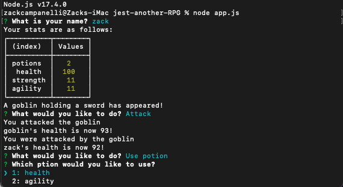

# Jest-Another-RPG

## Description

A simple command-line interface game written using object-oriented programming and jest as a testing framework

## Table of Contents

- [Installation](#Installation)
- [Usage](#Usage)
- [License](#License)
- [Questions](#Questions)

## Installation

Clone this repo to your local computer

## Usage

Open a command-line at the root folder of this project, then run `node app.js`

## License

A short and simple permissive license with conditions only requiring preservation of copyright and license notices. Licensed works, modifications, and larger works may be distributed under different terms and without source code.

## Questions

If you have any questions, concerns, or comments, feel free to contact me:

-GitHub: [Zacharycampanelli](https://github.com/Zacharycampanelli)  
-Email: [zaccamp@optonline.net](mailto:zaccamp@optonline.net)
